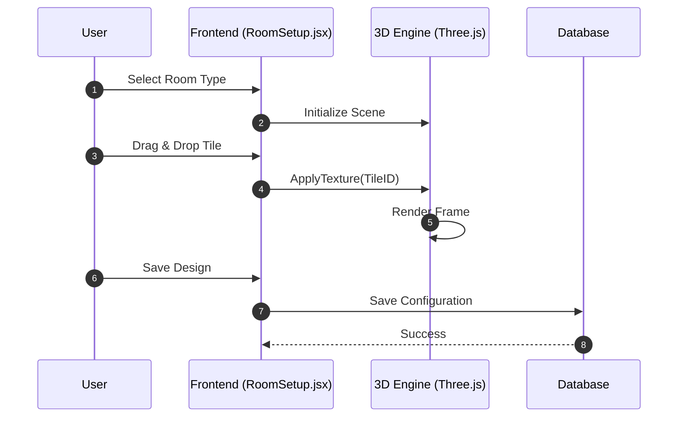
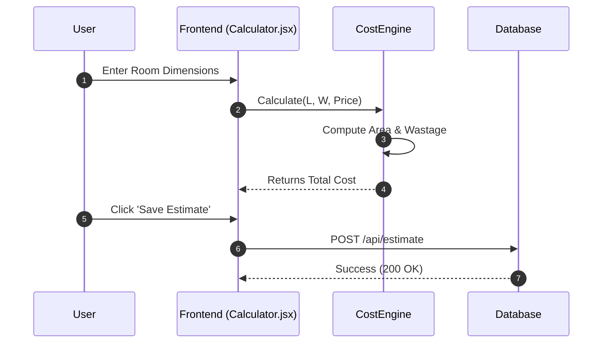
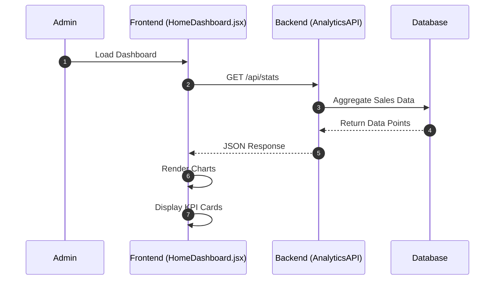

# System Sequence Diagrams

## 1. Visualization Module Flow

```mermaid
sequenceDiagram
    autonumber
    participant User
    participant Frontend as Frontend (RoomSetup.jsx)
    participant Engine as 3D Engine (Three.js)
    participant DB as Database

    User->>Frontend: Select Room Type
    Frontend->>Engine: Initialize Scene
    User->>Frontend: Drag & Drop Tile
    Frontend->>Engine: ApplyTexture(TileID)
    Engine->>Engine: Render Frame
    User->>Frontend: Save Design
    Frontend->>DB: Save Configuration
    DB-->>Frontend: Success
```

## 2. Estimation Module Flow

```mermaid
sequenceDiagram
    autonumber
    participant User
    participant Frontend as Frontend (Calculator.jsx)
    participant Logic as CostEngine
    participant DB as Database

    User->>Frontend: Enter Room Dimensions
    Frontend->>Logic: Calculate(L, W, Price)
    Logic->>Logic: Compute Area & Wastage
    Logic-->>Frontend: Returns Total Cost
    User->>Frontend: Click 'Save Estimate'
    Frontend->>DB: POST /api/estimate
    DB-->>Frontend: Success (200 OK)
```

## 3. Dashboard Module Flow

```mermaid
sequenceDiagram
    autonumber
    participant Admin
    participant Frontend as Frontend (HomeDashboard.jsx)
    participant Backend as Backend (AnalyticsAPI)
    participant DB as Database

    Admin->>Frontend: Load Dashboard
    Frontend->>Backend: GET /api/stats
    Backend->>DB: Aggregate Sales Data
    DB-->>Backend: Return Data Points
    Backend-->>Frontend: JSON Response
    Frontend->>Frontend: Render Charts
    Frontend->>Frontend: Display KPI Cards
```
